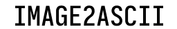

# Image2ASCII

[](https://github.com/TymurShashok/Image2ASCII/actions)
[](https://github.com/TymurShashok/Image2ASCII/blob/main/LICENSE)
[](https://github.com/TymurShashok/Image2ASCII/releases)

A lightweight C++ console application that converts images into ASCII art.

Image2ASCII supports **RGB ANSI colors**, multiple ASCII character sets, configurable output size, and two CLI modes: a classic command-line mode and an interactive terminal interface.

> **Platform:** Windows x64

## Preview



## Features

* Converts images supported by OpenCV (JPG, PNG, BMP, ...)
* **Two CLI modes**

  * **CLI 1:** pass arguments directly from Command Prompt / PowerShell
  * **CLI 2:** launch the executable without arguments and configure it interactively
* **RGB 24-bit color** output using ANSI escape sequences
* Black & white ASCII output
* **Three character sets:** Small, Medium and Large
* Configurable output width and height
* Original image size mode
* Brightness-based ASCII conversion
* Saves the generated ASCII art to `image.txt`
* CMake build with automatic OpenCV DLL copying on Windows
* Windows executable icon

## CLI 1 — Command Line

Run Image2ASCII with arguments:

```bash
Image2ASCII.exe <image> [options]
```

Example:

```bash
Image2ASCII.exe photo.jpg --symbols large --color rgb --width 120 --height 60
```

### Options

| Option                           | Description                    | Default     |
| -------------------------------- | ------------------------------ | ----------- |
| `<image>`                        | Path to the input image        | `image.jpg` |
| `--symbols small\|medium\|large` | Select the ASCII character set | `medium`    |
| `--color rgb\|bw`                | RGB or black & white output    | `rgb`       |
| `--width N`                      | Output width                   | `100`       |
| `--height N`                     | Output height                  | `100`       |
| `--original`                     | Use the original image size    | off         |

### Examples

Default configuration:

```bash
Image2ASCII.exe image.jpg
```

Large ASCII characters in black & white:

```bash
Image2ASCII.exe photo.png --symbols large --color bw
```

Custom output size:

```bash
Image2ASCII.exe photo.png --symbols small --color rgb --width 120 --height 60
```

## CLI 2 — Interactive Mode

You can also simply launch:

```bash
Image2ASCII.exe
```

Image2ASCII will open its interactive configuration interface.

Available commands:

| Command              | Description                  |
| -------------------- | ---------------------------- |
| `--filename <path>`  | Select the input image       |
| `--symbols small`    | Use the Small character set  |
| `--symbols medium`   | Use the Medium character set |
| `--symbols large`    | Use the Large character set  |
| `--color rgb`        | Enable RGB output            |
| `--color blackwhite` | Use black & white output     |
| `--width <N>`        | Set output width             |
| `--height <N>`       | Set output height            |
| `--original`         | Use the original image size  |
| `--start`            | Start conversion             |
| `--exit`             | Exit the application         |

Example:

```text
> --filename photo.jpg
> --symbols large
> --color rgb
> --width 120
> --height 60
> --start
```

After rendering, the application can be configured again without restarting the executable.

## Character Sets

| Mode       | Character set              |                              |
| ---------- | -------------------------- | ---------------------------- |
| **Small**  | `@#*+=-:. `                |                              |
| **Medium** | `@#W$9876543210?!;:=-,._ ` |                              |
| **Large**  | `@$#WmaOzAdzcfvxrjft/      | ()1{}[]?-_+~<>i!lI;:,"^`'. ` |

Characters are ordered from **darkest** to **lightest**.

## How It Works

1. OpenCV loads the image in BGR format.
2. Image2ASCII optionally resizes the image according to the selected configuration.
3. Every pixel is converted into RGB values.
4. Pixel brightness is calculated.
5. Brightness is mapped to a character from the selected ASCII set.
6. In RGB mode, the character is printed using its original pixel color.
7. The result is written to `image.txt` without ANSI color codes.

The conversion uses a brightness value based on the pixel's RGB components.

## Output Size

Characters are taller than they are wide, so the renderer compensates for terminal character proportions by using half the requested image height for the ASCII output.

For example:

```text
--width 120 --height 60
```

produces an ASCII image with approximately:

```text
120 characters wide
30 text lines high
```

## Project Structure

| File                    | Purpose                                             |
| ----------------------- | --------------------------------------------------- |
| `Image2ASCII.cpp`       | Application entry point and CLI mode selection      |
| `Config.h`              | Configuration and command-line parsing              |
| `ASCIIConverter.h/.cpp` | Pixel brightness → ASCII conversion                 |
| `Pixel.h`               | RGB pixel representation and brightness calculation |
| `Renderer.h/.cpp`       | ASCII rendering, ANSI colors and file output        |
| `CMakeLists.txt`        | CMake build configuration                           |
| `.github/workflows/`    | GitHub Actions CI / release workflows               |
| `Image2ASCII_Tab.jpg`   | Image used by the interactive interface             |
| `app.ico`               | Windows application icon                            |
| `app.rc`                | Windows resource configuration                      |

## Requirements

* **Windows 10/11 x64**
* **C++17**
* **CMake 3.16+**
* A C++17-compatible compiler
* **OpenCV**
* A terminal with ANSI / virtual terminal color support for RGB mode

Visual Studio 2022 with MSVC is recommended.

## Build

Clone the repository:

```bash
git clone https://github.com/TymurShashok/Image2ASCII.git
cd Image2ASCII
```

Configure and build with CMake:

```bash
cmake -S . -B build
cmake --build build --config Release
```

On Windows, the required OpenCV runtime DLLs are copied next to the executable after the build.

Run:

```bash
build\Release\Image2ASCII.exe
```

Or use CLI 1:

```bash
build\Release\Image2ASCII.exe photo.jpg --symbols medium --color rgb
```

## Release

The latest version is **v1.0.7**.

Recent updates include:

* Added an interactive CLI mode
* Added CLI mode selection depending on how the application is launched
* Added an Image2ASCII interface tab
* Improved output-size handling
* Fixed height/resizing issues
* Added a Windows application icon
* General quality-of-life improvements and bug fixes

## Known Limitations

* Windows only
* RGB mode requires terminal ANSI color support
* Command-line argument validation is still limited
* The current CLI parser expects option values after their corresponding flags
* Output dimensions are affected by terminal character proportions

## Author

**[Tymur Shashok](https://github.com/TymurShashok)**

GitHub: https://github.com/TymurShashok/Image2ASCII

---

If you find a bug or have an idea, feel free to open an issue.
