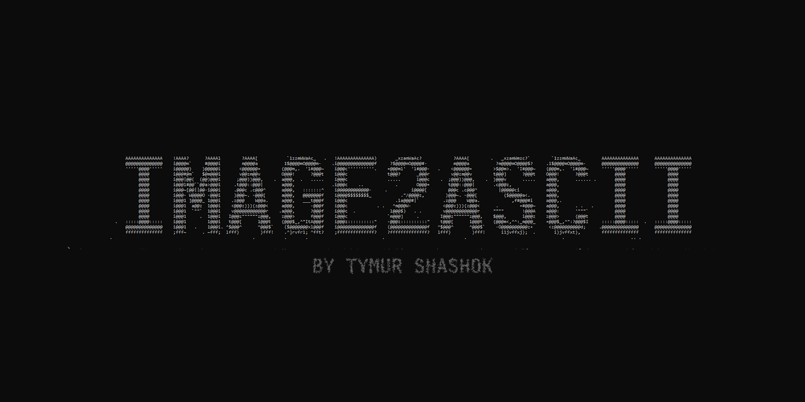

# Image2ASCII

[](https://github.com/TymurShashok/Image2ASCII/actions)
[](https://github.com/TymurShashok/Image2ASCII/blob/main/LICENSE)
[](https://github.com/TymurShashok/Image2ASCII/releases)

**Image2ASCII** is a Windows console application written in C++ that converts images into ASCII art. It supports RGB-colored and black-and-white output, three character sets, adjustable rendering settings, and an interactive terminal interface.



## Features

- Converts images using OpenCV (JPG, PNG, BMP, and other supported formats)
- RGB color output using ANSI escape sequences
- Black-and-white ASCII output
- Three character sets: `Small`, `Medium`, and `Large`
- Configurable output dimensions
- Scale and original-image-size modes
- Interactive terminal interface with a help menu
- Saves ASCII output to `image.txt`
- Windows application icon

## Download

Visit [GitHub Releases](https://github.com/TymurShashok/Image2ASCII/releases) for available releases.

## Usage

Image2ASCII can be used in two modes:

- **Argument mode:** pass options when launching the executable.
- **Interactive mode:** launch the executable without arguments and enter commands in the terminal.

### Argument mode

The application accepts named options. Specify the image path with `--filename`:

```powershell
Image2ASCII.exe --filename photo.jpg --symbols medium --color RGB
```

| Option | Description |
| --- | --- |
| `--filename <path>` | Input image path |
| `--symbols <Small\|Medium\|Large>` | Select the ASCII character set |
| `--color <RGB\|other>` | `RGB` enables color; another value selects black-and-white |
| `--width <N>` | Request an output width |
| `--height <N>` | Request an output height |
| `--scale <value>` | Scale the image dimensions |
| `--original` | Use the original image dimensions |
| `--exit` | Exit immediately |

Examples:

```powershell
Image2ASCII.exe --filename photo.jpg
Image2ASCII.exe --filename photo.png --symbols Small --color BW
Image2ASCII.exe --filename photo.jpg --symbols Large --color RGB --scale 0.5
```

**Note:** the current argument parser has limitations. The `--width` and `--height` options are handled in interactive mode, but their custom-size flag is not set in argument mode, so they may not affect rendering as expected. Use `--scale` or the interactive mode when configuring output size.

### Interactive mode

Launch the executable without arguments:

```powershell
Image2ASCII.exe
```

Enter commands one at a time:

```text
> --filename photo.jpg
> --symbols large
> --color rgb
> --width 120
> --height 100
> --start
```

Available commands:

| Command | Description |
| --- | --- |
| `--filename <path>` | Choose the input image |
| `--symbols small` | Use the Small character set |
| `--symbols medium` | Use the Medium character set |
| `--symbols large` | Use the Large character set |
| `--color rgb` | Enable RGB output |
| `--color blackwhite` | Enable black-and-white output |
| `--width <N>` | Set output width |
| `--height <N>` | Set output height |
| `--scale <value>` | Set image scale |
| `--original` | Use original image dimensions |
| `--help` | Display the help menu |
| `--start` | Start conversion |
| `--exit` | Exit the application |

After rendering, the program returns to the interactive interface so another conversion can be configured.

## Character sets

Characters are mapped to pixel brightness, from darker to lighter tones.

- **Small:** `@#*+=-:. `
- **Medium:** `@#W$9876543210?!;:=-,._ `
- **Large:** a denser character set for more tonal detail

## Output

The ASCII art is printed in the terminal and saved to `image.txt`. The text file contains no ANSI color escape sequences.

The renderer adjusts image height by half because terminal character cells are typically taller than they are wide. Actual proportions also depend on the terminal font.

## Build from source

### Requirements

- Windows 10/11 x64
- Visual Studio 2022 with the MSVC C++ toolchain
- CMake 3.16 or newer
- C++17-compatible compiler
- OpenCV

### Build

Clone the repository:

```powershell
git clone https://github.com/TymurShashok/Image2ASCII.git
cd Image2ASCII
```

If OpenCV is installed and discoverable by CMake:

```powershell
cmake -S . -B build
cmake --build build --Config Release
```

The GitHub Actions workflow installs OpenCV using vcpkg and builds the Windows target. See [GitHub Actions](https://github.com/TymurShashok/Image2ASCII/actions) for build runs.

## Project structure

| File | Purpose |
| --- | --- |
| `Image2ASCII.cpp` | Application entry point and mode selection |
| `Input.h` / `Input.cpp` | Reads interactive terminal commands |
| `Config.h` | Configuration and command-line parsing |
| `ASCIIConverter.h` / `ASCIIConverter.cpp` | Maps pixel brightness to ASCII characters |
| `Pixel.h` | Pixel color and brightness representation |
| `Renderer.h` / `Renderer.cpp` | Terminal rendering, help menu, and file output |
| `CMakeLists.txt` | CMake build configuration |
| `.github/workflows/` | GitHub Actions workflow |

## Current version

The source code identifies this version as **v1.0.8**. Recent changes include the `Input` class, improved interactive input handling, and a help menu.

## Known limitations

- Windows-focused application
- RGB output requires terminal ANSI color support
- Invalid or missing command-line values are not fully validated
- In argument mode, `--width` and `--height` do not currently activate custom-size rendering
- Interactive input is parsed as a command followed by a single value, so paths containing spaces may not work as expected

## License

Distributed under the [MIT License](LICENSE).

## Author

**[Tymur Shashok](https://github.com/TymurShashok)**

Found a bug or have an idea? Open an [issue](https://github.com/TymurShashok/Image2ASCII/issues).
